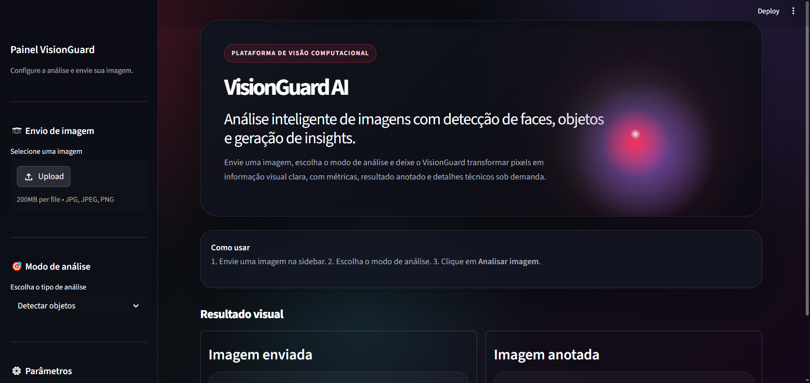
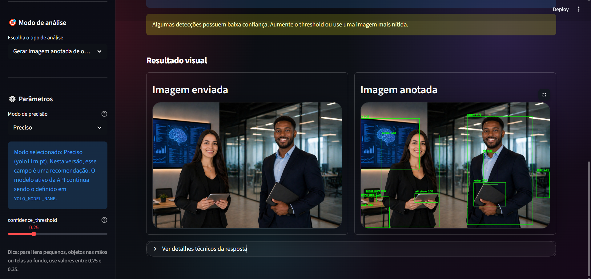
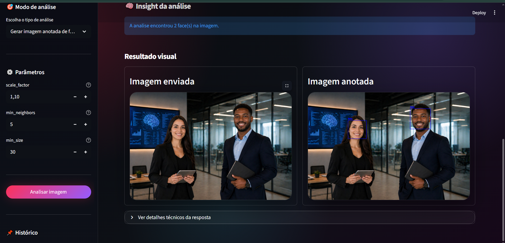

# VisionGuard API

VisionGuard API é um projeto de visão computacional em Python com backend FastAPI, frontend Streamlit e banco de dados SQLite simples. A aplicação detecta faces e objetos em imagens enviadas pelo usuário, retorna respostas JSON estruturadas, gera imagens anotadas, cria insights visuais com IA e salva o histórico das análises.

## Problema Que Resolve

Muitos projetos iniciais de IA ficam presos em notebooks. O VisionGuard transforma modelos de visão computacional em uma aplicação utilizável por pessoas comuns, com API, interface web, persistência em banco e uma experiência visual profissional para portfólio.

## Tecnologias Utilizadas

- Python 3.12+
- FastAPI
- Uvicorn
- OpenCV
- Ultralytics YOLO
- Pillow
- Pydantic
- python-multipart
- Streamlit
- Requests
- SQLite
- pytest

## Estrutura Do Projeto

```text
visionguard-api/
|-- app/
|   |-- main.py
|   |-- api/
|   |   `-- routes/
|   |       |-- health.py
|   |       |-- face_detection.py
|   |       |-- object_detection.py
|   |       |-- general_detection.py
|   |       `-- analysis.py
|   |-- core/
|   |   `-- config.py
|   |-- services/
|   |   |-- image_service.py
|   |   |-- analysis_service.py
|   |   |-- face_detection_service.py
|   |   `-- object_detection_service.py
|   |-- schemas/
|   |   |-- analysis.py
|   |   |-- detection.py
|   |   |-- face.py
|   |   `-- object.py
|   |-- db/
|   |   `-- database.py
|   `-- tests/
|-- streamlit_app/
|   `-- app.py
|-- outputs/
|-- sample_images/
|-- requirements.txt
|-- .gitignore
`-- README.md
```

## Como Instalar

Abra a pasta do projeto:

```bash
cd E:\visionguard-api
```

Crie e ative o ambiente virtual:

```bash
python -m venv .venv
.venv\Scripts\activate
```

Instale as dependências:

```bash
pip install -r requirements.txt
```

## Como Rodar O Backend

Inicie a API FastAPI com Uvicorn:

```bash
uvicorn app.main:app --reload --port 8001
```

A API ficará disponível em:

```text
http://127.0.0.1:8001
```

Documentação interativa:

```text
http://127.0.0.1:8001/docs
```

## Como Rodar O Frontend

Mantenha o backend FastAPI rodando. Depois, abra outro terminal na pasta do projeto e execute:

```bash
streamlit run streamlit_app/app.py
```

O app Streamlit permite enviar uma imagem, visualizar a prévia, escolher o modo de análise, ajustar parâmetros, ver respostas JSON formatadas, consultar métricas e visualizar imagens anotadas retornadas pela API.

## Frontend Streamlit

O frontend foi organizado para funcionar como um dashboard profissional de IA. Ele usa apenas Streamlit e CSS customizado, sem React e sem frameworks frontend externos.

Antes de abrir o Streamlit, rode o backend:

```bash
uvicorn app.main:app --reload --port 8001
```

Depois rode o frontend:

```bash
streamlit run streamlit_app/app.py
```

Fluxo da interface:

- Envie uma imagem pela sidebar.
- Escolha o modo de análise.
- Ajuste `confidence_threshold` quando o modo envolver objetos.
- Escolha o `Modo de precisão` para entender qual modelo YOLO usar no backend.
- Use o `Filtro de classes` para focar em objetos sem pessoas, itens nas mãos, pessoas, animais, veículos, alimentos ou eletrônicos.
- Ajuste `scale_factor`, `min_neighbors` e `min_size` quando o modo envolver faces.
- Clique em `Analisar imagem`.
- Veja métricas, insight resumido, imagem original, imagem anotada quando existir e detalhes técnicos dentro de um expander.

Screenshots da interface:







## Experiência Do Frontend

A interface Streamlit foi pensada como uma landing page premium de produto de IA:

- Fundo escuro com destaques neon em vermelho e roxo.
- Hero section com o título `VisionGuard AI`, descrição do produto e visual futurista.
- Sidebar limpa com envio de imagem, modo de análise e parâmetros dos modelos.
- Área de resultado antes/depois para imagem original e imagem anotada.
- Cards de métricas para total de objetos, total de faces e confiança média.
- Seção de insight visual com resumo, contexto estimado, nível de atenção e recomendações.
- Aviso visual quando alguma detecção de objeto retornar confiança abaixo de `0.50`.
- Filtro simples por classes para reduzir ruído nas detecções do YOLO.
- Filtro `Itens nas mãos` para tentar focar em objetos como celular, livro, laptop, garrafa, mochila e bolsa.
- Histórico recente carregado do SQLite.
- Resposta JSON técnica dentro de uma seção expansível.

## Precisão Do YOLO

O modelo YOLO usado pelo backend pode ser configurado em `app/core/config.py`:

```python
YOLO_MODEL_NAME = "yolo11n.pt"
YOLO_IMAGE_SIZE = 1280
```

Modelos menores são mais rápidos, porém tendem a ser menos precisos. Modelos maiores costumam ser mais precisos, mas exigem mais processamento e podem deixar a resposta da API mais lenta.

O parâmetro `YOLO_IMAGE_SIZE` controla o tamanho usado na inferência. Valores maiores ajudam a encontrar objetos menores ou mais distantes, como telas ao fundo e itens nas mãos, mas deixam a análise mais lenta.

Sugestões:

- `yolo11n.pt`: modo rápido, ideal para máquinas mais simples e testes rápidos.
- `yolo11s.pt`: modo balanceado, melhor equilíbrio entre velocidade e precisão.
- `yolo11m.pt`: modo preciso, melhor qualidade de detecção, porém mais pesado.

Depois de alterar `YOLO_MODEL_NAME`, reinicie o backend:

```bash
uvicorn app.main:app --reload --port 8001
```

No Streamlit, o campo `Modo de precisão` mostra essas opções como orientação. Para manter o MVP simples e estável, a troca efetiva do modelo continua sendo feita pelo arquivo `config.py`.

Para objetos pequenos, tablets, celulares ou telas ao fundo, use `confidence_threshold` entre `0.25` e `0.35`. Valores altos, como `0.70`, deixam a análise muito rigorosa e podem ocultar objetos relevantes.

## Observação Sobre Pessoas E Objetos

O YOLO trata `person` como uma classe de objeto. Por isso, quando uma imagem contém pessoas, o modelo pode desenhar uma caixa no corpo inteiro antes de detectar objetos menores, como celular, livro, garrafa ou laptop.

Para uma experiência mais intuitiva no frontend, use:

- `Objetos sem pessoas`: ignora a classe `person` e tenta destacar somente outros itens da cena.
- `Itens nas mãos`: tenta focar em classes comuns que uma pessoa pode segurar, como `cell phone`, `book`, `laptop`, `bottle`, `cup`, `handbag` e `backpack`.
- `Todos (inclui pessoas)`: mantém o comportamento bruto do YOLO, incluindo pessoas.

Importante: o modelo COCO usado pelo YOLO não possui uma classe específica chamada `tablet`. Dependendo da imagem, um tablet pode aparecer como `cell phone`, `book`, `laptop` ou não ser detectado.

## Segurança

O VisionGuard API possui proteções básicas importantes para um MVP de visão computacional que recebe uploads e executa modelos de IA.

Proteções implementadas:

- Limite de tamanho de upload configurado por `MAX_UPLOAD_SIZE_MB`.
- Limite de resolução e quantidade máxima de pixels da imagem.
- Validação de extensão, aceitando apenas `.jpg`, `.jpeg` e `.png`.
- Validação de `content-type`, aceitando apenas `image/jpeg` e `image/png`.
- Validação do decode da imagem com OpenCV antes de executar detecção.
- Rejeição de arquivos vazios ou inválidos.
- Rate limiting em rotas pesadas que executam OpenCV/YOLO.
- Retorno de `429 Too Many Requests` quando o limite de requisições é excedido.
- Uso de UUID no nome dos arquivos anotados para evitar sobrescrita.
- Queries parametrizadas no SQLite para reduzir risco de SQL injection.

Rotas protegidas por rate limiting:

- `POST /detect/faces`
- `POST /detect/faces/annotated`
- `POST /detect/objects`
- `POST /detect/objects/annotated`
- `POST /detect/all`
- `POST /detect/all/annotated`
- `POST /analyze/image`

Configurações principais:

```python
MAX_UPLOAD_SIZE_MB = 10
MAX_IMAGE_WIDTH = 4096
MAX_IMAGE_HEIGHT = 4096
MAX_IMAGE_PIXELS = 16_000_000
RATE_LIMIT_MAX_REQUESTS = 60
RATE_LIMIT_WINDOW_SECONDS = 60
```

Limitações atuais do MVP:

- Ainda não há autenticação.
- Ainda não há autorização por usuário.
- O rate limiter atual é em memória, adequado para MVP/local, mas não para múltiplos servidores.
- Ainda não há CORS restritivo configurado para produção.
- Ainda não há limpeza automática dos arquivos antigos em `outputs/`.
- Ainda não há logs estruturados de auditoria.

Recomendações futuras para produção:

- Adicionar autenticação, como API key, OAuth2 ou login com provedor externo.
- Usar Redis, API Gateway, Nginx ou Cloudflare para rate limiting distribuído.
- Configurar CORS restritivo para permitir apenas domínios confiáveis.
- Adicionar logs estruturados com rota, IP, status code e tempo de resposta.
- Criar limpeza automática para arquivos antigos em `outputs/`.
- Definir política de retenção para imagens e histórico.
- Executar a aplicação com HTTPS.

Mais detalhes estão documentados em [`SECURITY.md`](SECURITY.md).

## Banco De Dados

O projeto usa SQLite para manter a configuração simples e adequada para portfólio. O arquivo do banco é criado automaticamente em:

```text
data/visionguard.db
```

Cada análise salva contém nome do arquivo, resumo, nível de atenção, contexto detectado, recomendações, totais, confiança média, caminho da imagem anotada e data de criação.

## Prints

### Tela Inicial


### Detecção De Objetos


### Detecção De Faces


## Endpoints

### GET /

Resposta esperada:

```json
{
  "message": "VisionGuard API is running"
}
```

### GET /health

Resposta esperada:

```json
{
  "status": "ok"
}
```

### POST /detect/faces

Detecta faces usando OpenCV Haar Cascade.

Parâmetros opcionais:

- `scale_factor`: deve ser maior que `1.0`. Padrão: `1.1`.
- `min_neighbors`: deve ser maior ou igual a `1`. Padrão: `5`.
- `min_size`: deve ser maior ou igual a `20`. Padrão: `30`.

Exemplo:

```bash
curl -X POST "http://127.0.0.1:8001/detect/faces?scale_factor=1.1&min_neighbors=5&min_size=30" ^
  -F "file=@sample_images/person.jpg"
```

### POST /detect/faces/annotated

Detecta faces, desenha caixas delimitadoras e salva a imagem anotada em `outputs/`.

Resposta esperada:

```json
{
  "message": "Annotated face image created successfully",
  "output_path": "outputs/person_a1b2c3d4.jpg",
  "total_faces": 1
}
```

### POST /detect/objects

Detecta objetos usando um modelo YOLO leve da biblioteca Ultralytics.

Parâmetro opcional:

- `confidence_threshold`: deve estar entre `0` e `1`. Padrão: `0.40`.
- `classes`: lista opcional de classes YOLO separadas por vírgula. Exemplo: `person,car,dog`.

Exemplo:

```bash
curl -X POST "http://127.0.0.1:8001/detect/objects?confidence_threshold=0.5" ^
  -F "file=@sample_images/street.jpg"
```

Exemplo filtrando apenas algumas classes:

```bash
curl -X POST "http://127.0.0.1:8001/detect/objects?confidence_threshold=0.5&classes=person,car,dog" ^
  -F "file=@sample_images/street.jpg"
```

### POST /detect/objects/annotated

Detecta objetos, desenha caixas delimitadoras e salva a imagem anotada em `outputs/`.

Resposta esperada:

```json
{
  "message": "Annotated image created successfully",
  "output_path": "outputs/street_a1b2c3d4.jpg",
  "total_objects": 2
}
```

### POST /detect/all

Detecta faces e objetos na mesma imagem.

Parâmetros opcionais:

- `confidence_threshold`: deve estar entre `0` e `1`. Padrão: `0.40`.
- `classes`: lista opcional de classes YOLO separadas por vírgula. Exemplo: `person,car,dog`.
- `scale_factor`: deve ser maior que `1.0`. Padrão: `1.1`.
- `min_neighbors`: deve ser maior ou igual a `1`. Padrão: `5`.
- `min_size`: deve ser maior ou igual a `20`. Padrão: `30`.

Resposta esperada:

```json
{
  "total_faces": 1,
  "total_objects": 3,
  "faces": [
    {
      "x": 100,
      "y": 80,
      "width": 150,
      "height": 150
    }
  ],
  "objects": [
    {
      "label": "person",
      "confidence": 0.87,
      "box": {
        "x1": 80,
        "y1": 40,
        "x2": 300,
        "y2": 500
      }
    }
  ]
}
```

### POST /detect/all/annotated

Detecta faces e objetos, desenha todas as caixas delimitadoras em uma única imagem e salva o resultado em `outputs/`.

Resposta esperada:

```json
{
  "message": "Annotated combined image created successfully",
  "output_path": "outputs/street_a1b2c3d4.jpg",
  "total_faces": 1,
  "total_objects": 3
}
```

### POST /analyze/image

Executa detecção combinada, gera imagem anotada, cria um insight visual em linguagem natural e salva a análise no SQLite.

Resposta esperada:

```json
{
  "id": 1,
  "filename": "street.jpg",
  "summary": "A análise encontrou 1 face(s) e 3 objeto(s). Principais detecções: person (1), car (1), backpack (1). O contexto visual estimado é 'cena urbana ou de trânsito' com nível de atenção 'baixo'.",
  "risk_level": "baixo",
  "detected_context": "cena urbana ou de trânsito",
  "recommendations": [
    "Faces detectadas com coordenadas prontas para uso.",
    "Objetos detectados com labels e confiança YOLO."
  ],
  "total_faces": 1,
  "total_objects": 3,
  "average_confidence": 0.87,
  "output_path": "outputs/street_a1b2c3d4.jpg",
  "faces": [],
  "objects": []
}
```

### GET /analysis/history

Retorna as análises recentes salvas no SQLite.

Exemplo:

```bash
curl "http://127.0.0.1:8001/analysis/history?limit=10"
```

## O Que Aprendi Construindo Este Projeto

- Como organizar um projeto FastAPI por rotas, serviços e schemas.
- Como validar uploads de imagem por extensão e content-type.
- Como converter bytes enviados por upload em imagens compatíveis com OpenCV.
- Como usar Haar Cascade do OpenCV para detecção facial.
- Como ajustar o Haar Cascade com query parameters.
- Como usar um modelo YOLO pré-treinado com Ultralytics.
- Como filtrar detecções YOLO por confiança mínima.
- Como construir um frontend Streamlit que consome uma API FastAPI.
- Como persistir histórico de análises com SQLite.
- Como gerar insights visuais a partir das detecções dos modelos.
- Como retornar respostas JSON limpas para outputs de visão computacional.

## Próximas Melhorias

- Integrar OpenAI ou um VLM local para gerar descrições mais ricas das imagens.
- Adicionar logs estruturados.
- Adicionar Docker depois que o MVP estiver estável.
- Adicionar CI com GitHub Actions.
- Criar mais testes com imagens de exemplo.
- Adicionar autenticação opcional para deploy privado.

## Observações

O modelo YOLO é carregado uma vez no primeiro endpoint que usa detecção de objetos. Na primeira execução, a biblioteca Ultralytics pode baixar automaticamente os pesos do modelo caso eles ainda não existam localmente.
